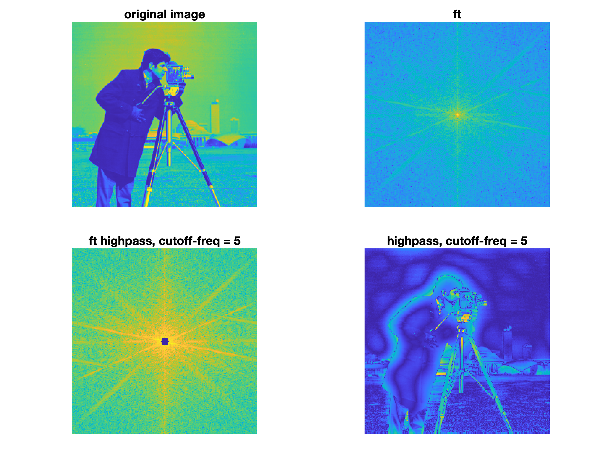

## 數位影像處理 Digital Image Processing
### 525 U0920 | ESOE5096

**R11525079 游子霆**

#### Computer assignments:

* [Computer Assignment 1](ca_1)
  Introduction to Image Display and Manipulation
  - Histogram Equalization
    

  - Spatial Resolution
    

  - Bitplane
    

* [Computer Assignment 2](ca_2)
  Fourier Transform and Filtering in the Frequency Domain
  - Fourier Transform
    

  - Ideal Lowpass Filter & Highpass Filter
    
    
