## DIP CA1

工海碩一 游子霆 R11525079

### 1. Spatial Resolution
1.
    a.
    
    b.
    
    c.
    
    d.
    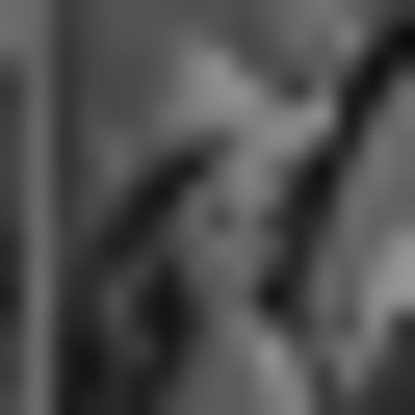

    The results won't be the same, because the information lost as the size of the image shrinks. The smaller the size, the less information.

2.
    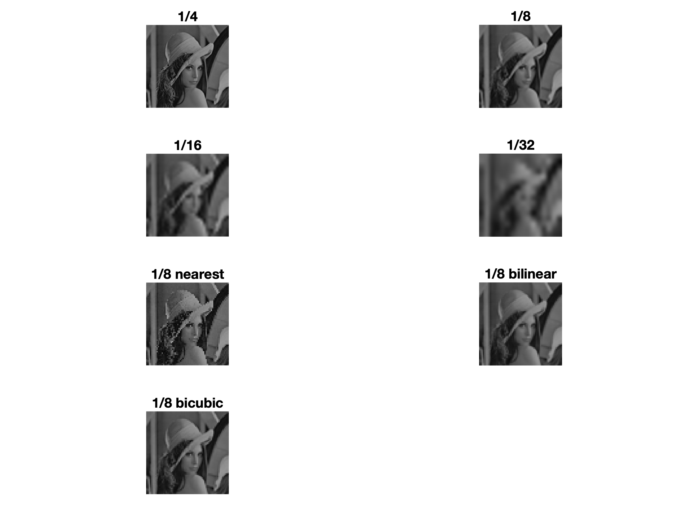

### 2. Bit Planes

The 8 bit planes of the cameraman image:
The bit planes are multiplied by 255 for visualization.

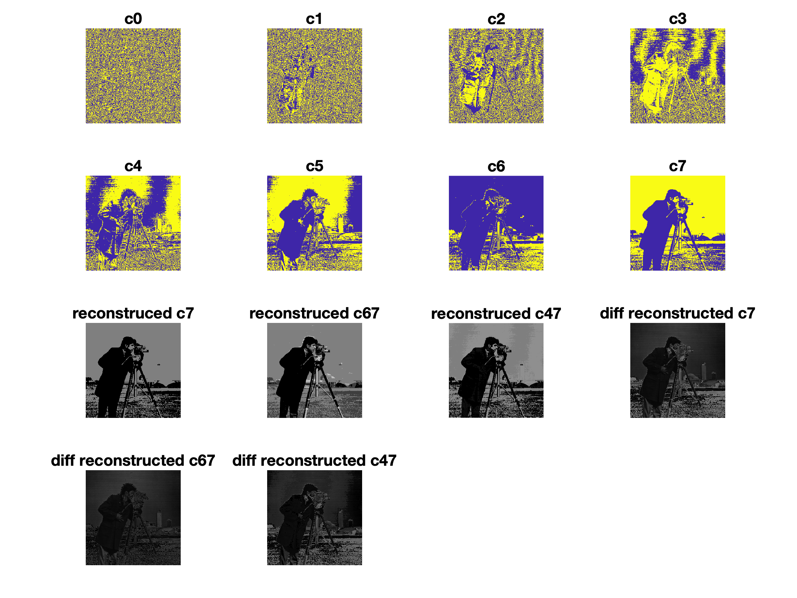

### 3. Histogram Operation

Original image histogram: 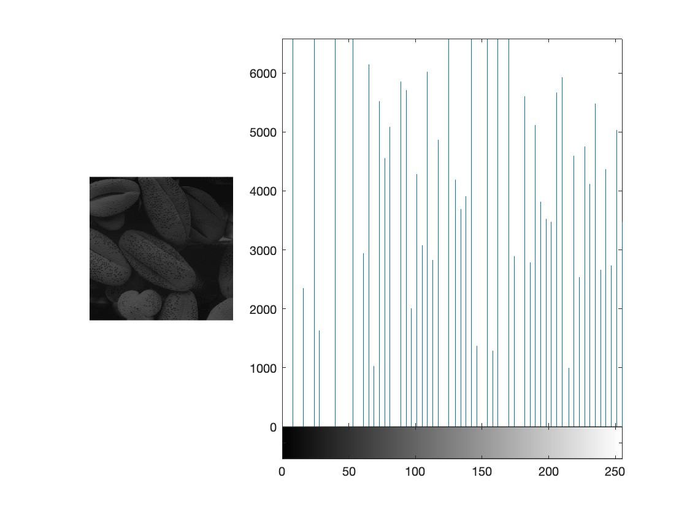

**pollen.tif**
a.
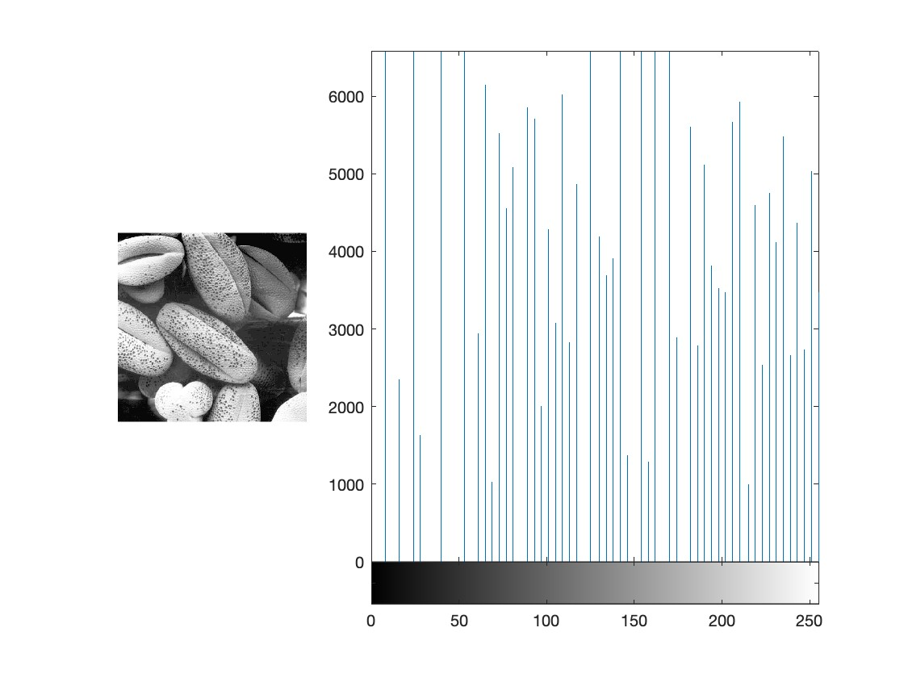

b. adjust image contrast based on the standard deviation and the mean of the image: [avg-n*sigma avg+n*sigma],
with n = 2
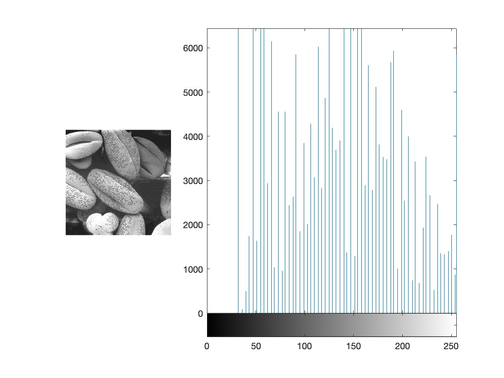

**aerial.tif**
a.
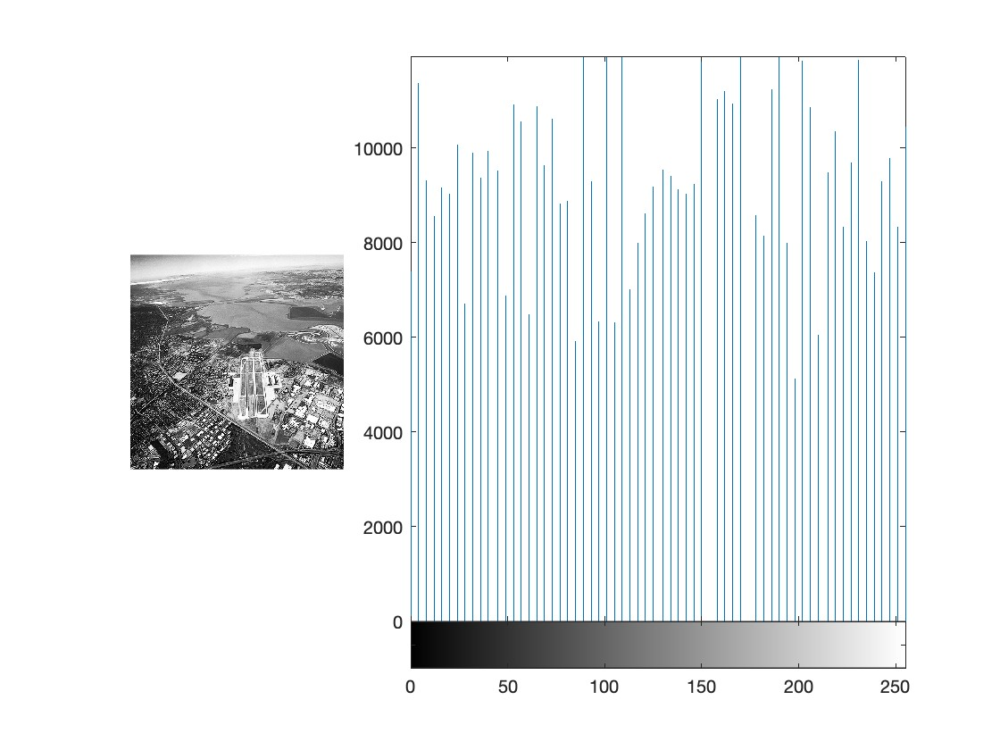

b. adjust image contrast based on the standard deviation and the mean of the image: [avg-n*sigma avg+n*sigma],
with n = 1
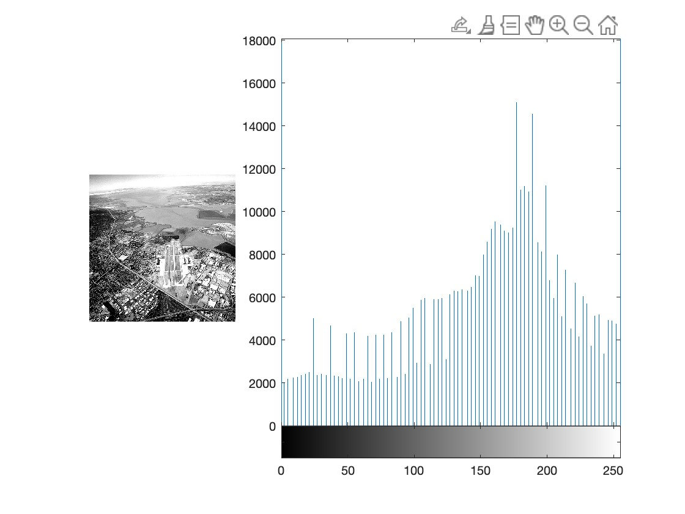

### 4. Transformations and Registration

#### Transformations
original:

fs:
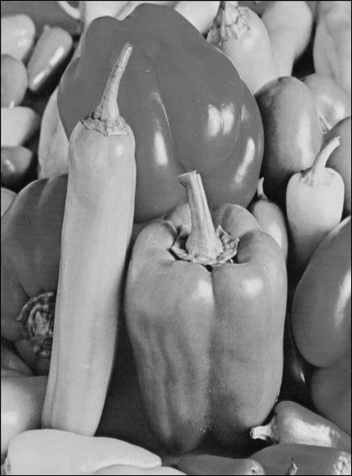

fsr:
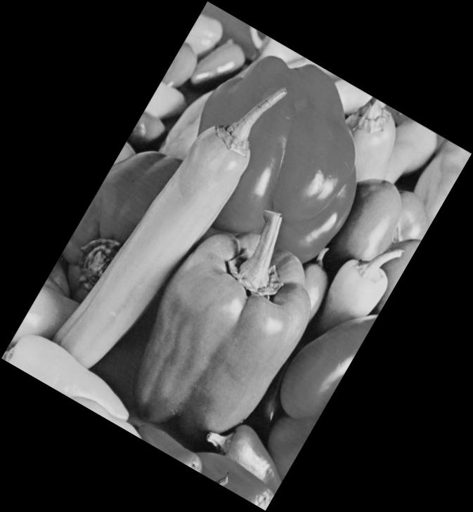

fss:
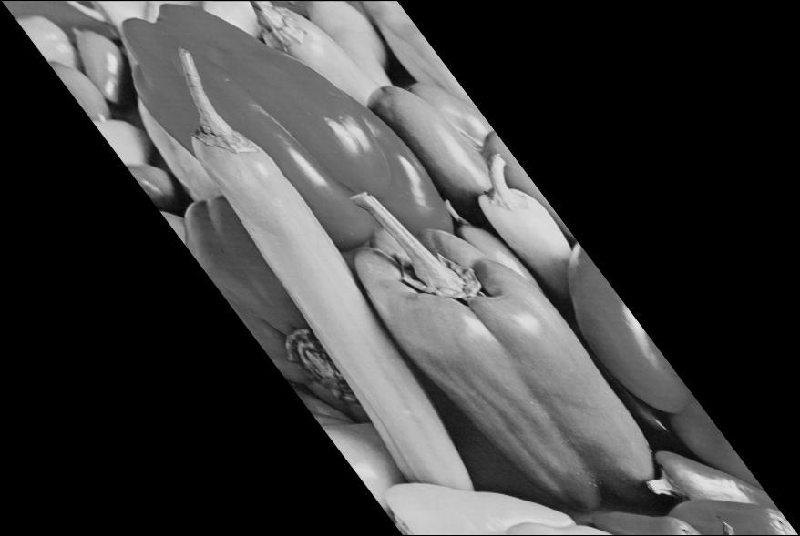

#### Registration - 4 Pairs

**fs**:
fs2:
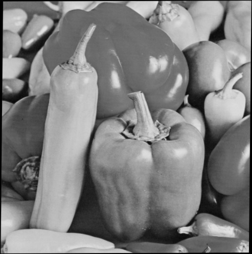

original:

fs:

**fsr**:
fs2:

original:

fsr:

**fss**:
fss2:
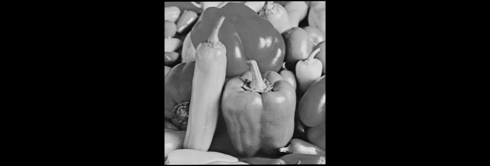

original:

fss:

#### Registration - 8 Pairs

**fs**:
fs2:
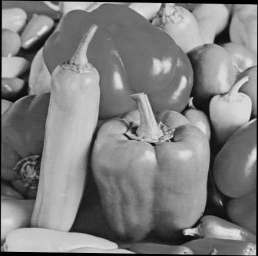

original:

fs:

**fsr**:
fs2:
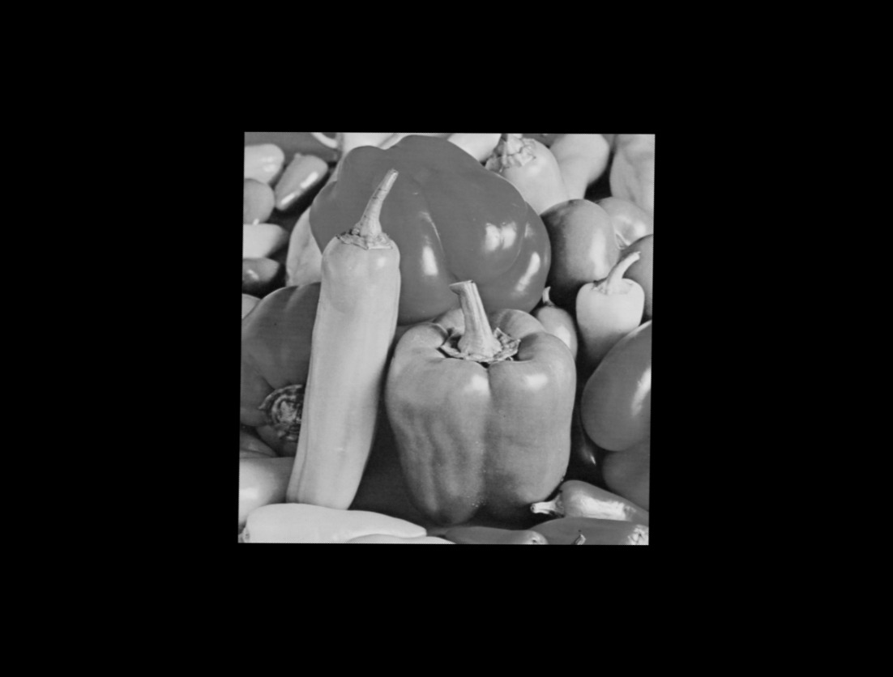

original:

fsr:

**fss**:
fss2:

original:

fss:

There aren't much difference between 4 pairs and 8 pairs.
