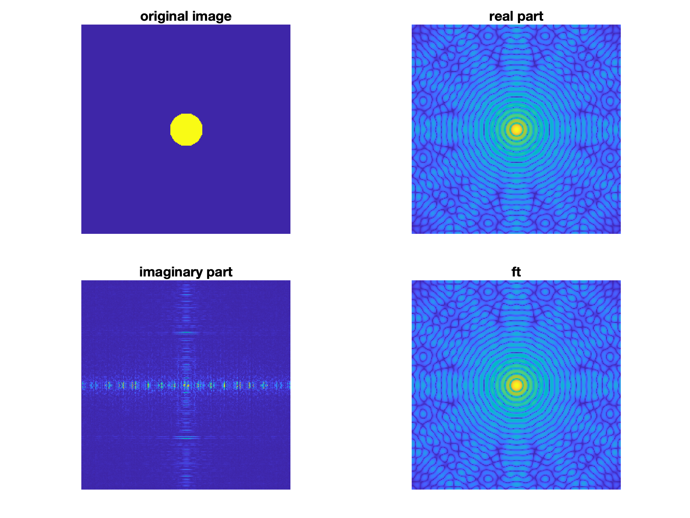

## DIP CA2

工海碩一 游子霆 R11525079

#### 1. Fourier Transforms of Image

* Single Edge
  

* box
  

* rotated box
  

* circle
  

#### 2. Ideal Lowpass and Highpass Filtering

* Lowpass filter with cutoff frequency = 5
  

* Lowpass filter with cutoff frequency = 30
  

* Highpass filter with cutoff frequency = 5
  

* Highpass filter with cutoff frequency = 30
  

Highpass parts are mostly edges, while lowpass parts are just blurred.
With lower cutoff frequency, the lowpass part gets blurred even more.
WIth higher cutoff frequency, the highpass part has clearer edge details.

#### 3. Gaussian Filtering

* Sigma = 10
  Lowpass part is blurred significantly
  

* Sigma = 30
  Lowpass part is blurred but less obvious than sigma = 10
  

Highpass parts are not that different as the highpass part extracted using ideal highpass filter.
