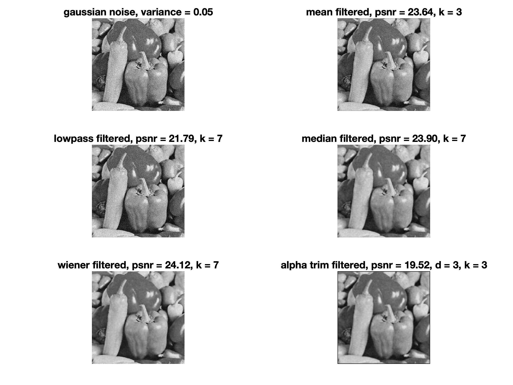
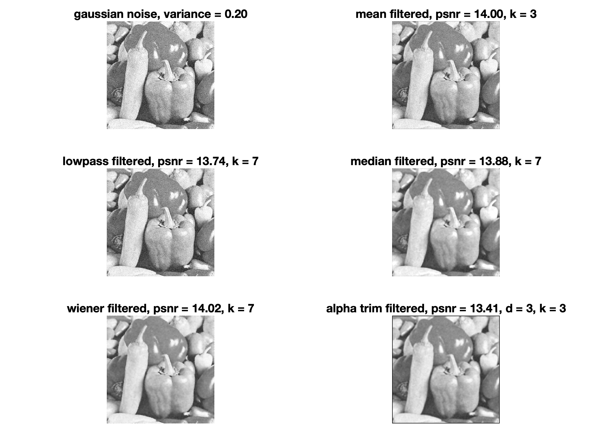
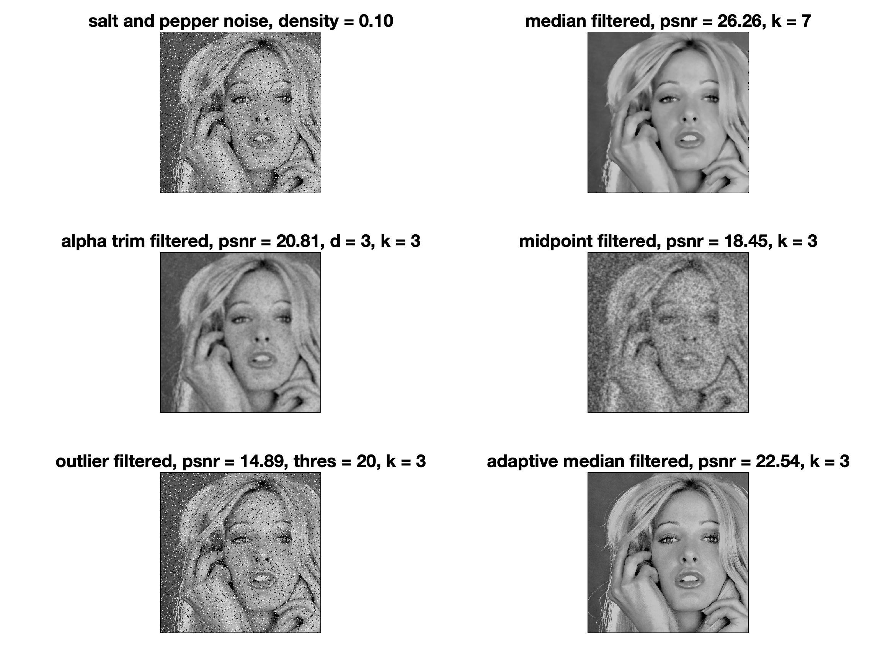
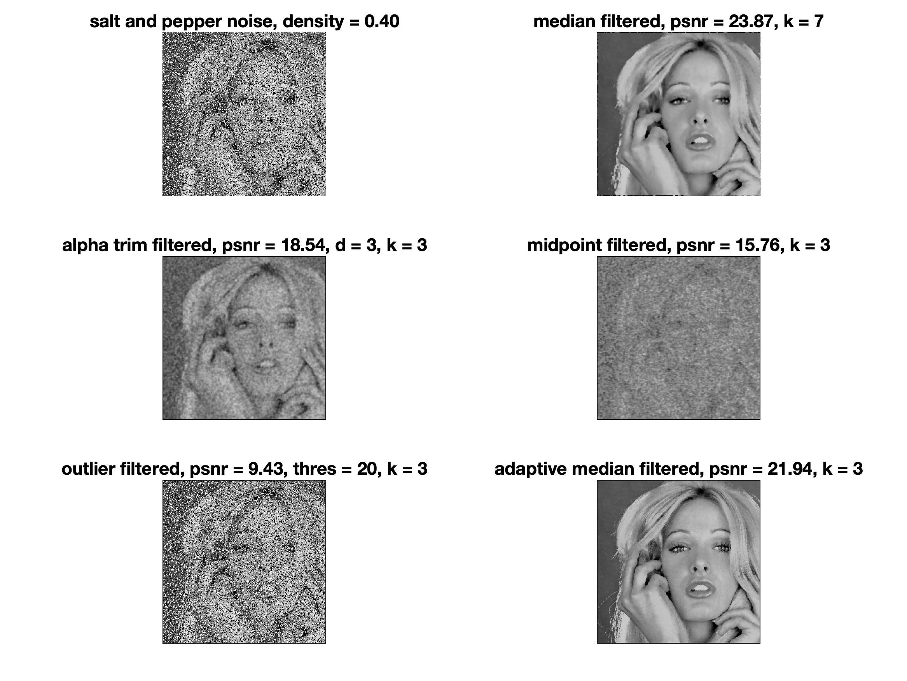
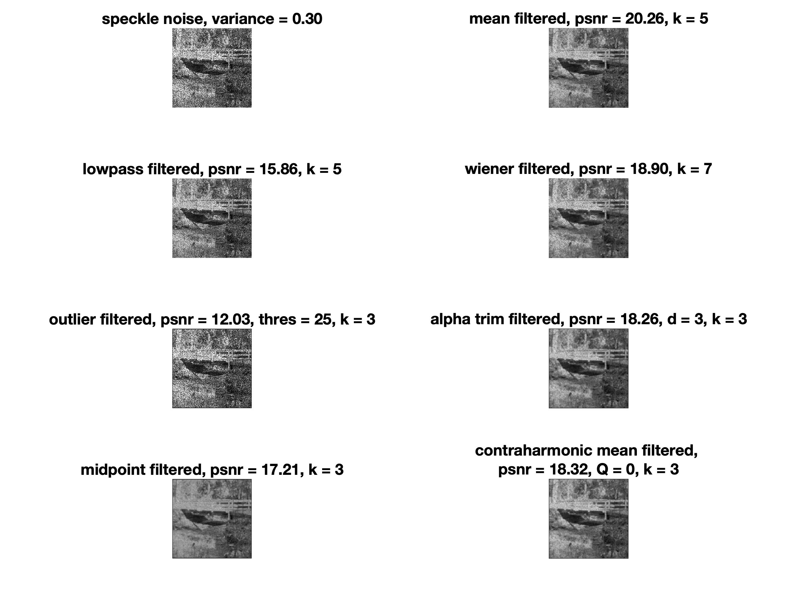

## DIP CA3

工海碩一 游子霆 R11525079

#### 2. Gaussian Noise Reduction

* Mean filter: O(kernel_size * N)
* Median filter: O(kernel_size * N)
* Alpha-trimmed mean filter: O(2 * kernel_size * N) = O(kernel_size * N)

#### 3. Salt-and-pepper Noise Reduction

* Median filter: O(kernel_size * N)
* Alpha-trimmed mean filter: O(2 * kernel_size * N) = O(kernel_size * N)
* Midpoint filter: : O(2 * kernel_size * N) = O(kernel_size * N)
* Outlier filter: O(kernel_size * N)
* Adaptive median filter: O(N * N^2)

Adaptive median filter has the worst performance in worst case.

#### 4. Speckle Noise Reduction

* Alpha-trimmed mean filter: O(2 * kernel_size * N) = O(kernel_size * N)
* Midpoint filter: : O(2 * kernel_size * N) = O(kernel_size * N)
* Outlier filter: O(kernel_size * N)
* Contraharmonic mean filter: O(2 * kernel_size * N) = O(kernel_size * N)
